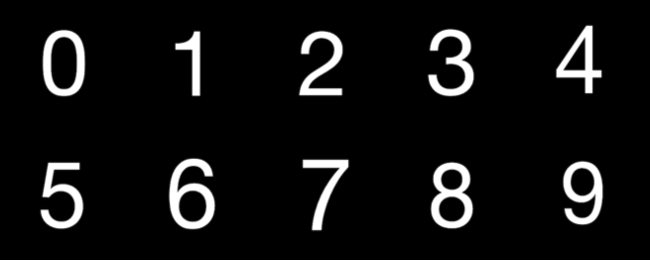

# Captcha Generator
---
### CAPTCHA
* Recent years, with the help of Deep Learning(Convolution Neural Networks), breaking CAPTCHA is more and more easy, causing many websites and systems become insecure.
* Reference: https://en.wikipedia.org/wiki/CAPTCHA

### Style Transfer
* Hence, we aim to reinforcement CAPTCHA by Style Transfering using Convolutional Neural Networks.
* Reference: https://ieeexplore.ieee.org/document/7780634/

### Halftone Style
* Halftone Images rely on a basic optical illusion: the tiny halftone dots are blended into smooth tones by the human eye, which makes robots hard to recognize, but easy for human beings.
* Reference: https://en.wikipedia.org/wiki/Halftone

### Halftone CAPTCHA

